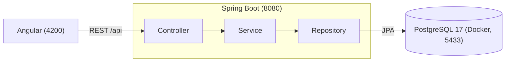

<div align="center">

#  StudyOS

**My personal system to plan, log, and understand how I study.**

[🇧🇷 Português](README.md) · 🇺🇸 English


</div>

---

##  Why StudyOS exists

I'm a Computer Science student who also works as a software developer, and I'm always studying: college courses, Java, Angular, databases, English, algorithms. For a long time I tracked all of it in a **spreadsheet**. It worked, but filling it in was tedious and I almost never looked at the data afterwards.

Then came the question: *what if I turned this problem into my own study project?*

**StudyOS** was born with two goals at once:

1. **To be a real tool** that I use every day to organize my studies and measure my progress.
2. **To be my Full Stack lab**: learning Java, Spring Boot, Angular, PostgreSQL, Docker, and cloud by building something real, the way it's done professionally (tests, migrations, Pull Requests).

It's not just a to-do list. The idea is to record what I **actually** studied and turn that into data that helps me decide what to do next.

```
PLAN  →  STUDY  →  LOG  →  MEASURE  →  ANALYZE  →  ADJUST
```

##  What it will do

- Organize studying into **areas → subjects → topics** (College, Full Stack, English…)
- Build a **template week** and adjust it each week
- **Log study sessions** with duration, focus (1 to 5), and notes, in a few seconds
- Show a **dashboard** with hours per day, subject, and area, and how much of the plan was fulfilled
- Compare periods (week, month, quarter, year) **without judgment**: more hours isn't always better
- Work as an installable **PWA** on the phone

##  Where we are

The project is built in **vertical slices**: each feature goes from the database all the way to the screen before the next one starts.

| Slice | What it is | Status |
|---|---|--|
| 0 | Foundation: repository, Dockerized database, backend and frontend running, layout and light/dark theme | ✅ Done |
| 1 | **Areas**: REST API (backend) |  Done |
| 1 | **Areas**: Angular screens |  Next |
| 2 | Subjects |  |
| 3 | Topics and progress |  |
| 4 | Study sessions |  |
| 5 | Weekly planning |  |
| 6 | Dashboard and metrics |  |
| 7 | PWA and polish |  |

## 🛠 Tech stack

**In use today**

<p>
  
</p>

- **Backend:** Java 21 · Spring Boot 4 (Web, Data JPA, Validation, Actuator) · Hibernate · Flyway
- **Frontend:** Angular 22 (standalone components, Signals, lazy-loaded routes) · TypeScript · SCSS
- **Database:** PostgreSQL 17, with versioned migrations
- **Testing:** JUnit 5 · Mockito · MockMvc · Testcontainers (a real PostgreSQL in tests) · Vitest
- **Infra:** Docker and Docker Compose · Git and GitHub

**Coming next**

<p>
  
</p>

RxJS and Reactive Forms · JWT authentication with Spring Security · PWA with service worker · **AWS** deployment · CI/CD with **GitHub Actions** · observability and backups

##  Architecture



- **Controller:** only translates HTTP (routes, validation, status codes). No business rules.
- **Service:** where the rules live (unique names, default position, etc.) and transactions.
- **Repository:** database access with Spring Data JPA.
- **Entities never become JSON**: the API speaks through DTOs (`record`).
- The **database schema only changes through migrations** (Flyway). Hibernate just validates it.
- Errors follow the `ProblemDetail` standard (RFC 9457): `400` with per-field errors, `404`, and `409`.

##  How I build it

I'm also using this project to practice working the professional way:

- **Spec first:** before coding, I designed the architecture, database, rules, and endpoints ([see the spec](docs/specs/2026-09-28-studyos-fase1-mvp-design.md), in Portuguese).
- **TDD:** I write the test, **watch it fail**, implement the minimum to make it pass, then refine.
- **Three levels of tests:** service (fast, with Mockito), controller (MockMvc), and end-to-end against a real PostgreSQL (Testcontainers).
- **One branch and one Pull Request per slice**, with commits following Conventional Commits (`feat:`, `fix:`, `docs:`…).

##  Getting started

**Prerequisites:** Java 21 · Node.js 24+ · Angular CLI 22 (`npm install -g @angular/cli@22`) · Docker Desktop running.

**1. Database** (port **5433**, to avoid clashing with a local PostgreSQL):

```bash
copy .env.example .env
docker compose up -d
```

**2. Backend** (port 8080):

```bash
cd backend
.\mvnw.cmd spring-boot:run
```

**3. Frontend** (port 4200), in another terminal:

```bash
cd frontend
npm install
ng serve
```

Open **http://localhost:4200**. To check that the backend and database are up: http://localhost:4200/actuator/health

> On macOS/Linux, use `cp .env.example .env` and `./mvnw spring-boot:run`.

**Tests**

```bash
cd backend
.\mvnw.cmd test        # requires Docker running (Testcontainers)
```

```bash
cd frontend
ng test --watch=false
```

## 🔌 Areas API (available now)

| Method | Route | What it does |
|---|---|---|
| `GET` | `/api/areas?includeArchived=false` | Lists areas |
| `GET` | `/api/areas/{id}` | Gets one area |
| `POST` | `/api/areas` | Creates (`201` with `Location`) |
| `PUT` | `/api/areas/{id}` | Updates |
| `PATCH` | `/api/areas/{id}/archive` · `/unarchive` | Archives / unarchives |

Areas are **never deleted**: they are archived, so the study history is never lost.

## 🗂 Repository structure

```
studyos/
├── backend/             Spring Boot (Maven, Java 21)
├── frontend/            Angular
├── docs/
│   ├── specs/           Project design
│   └── plans/           Implementation plan for each slice
├── docker-compose.yml   PostgreSQL 17
└── .env.example         Database variables
```

> The documentation in `docs/` is in Portuguese.

## 🗺 Roadmap

- [x] **Phase 0** · Foundation (Git, Docker, Spring Boot, Angular, layout)
- [ ] **Phase 1 · MVP** · Areas, subjects, topics, planning, sessions, and basic dashboard
- [ ] **Phase 2** · Timer/Pomodoro, goals, streak, charts, and reports
- [ ] **Phase 3** · College (exams and grades), projects, books, LeetCode, and English
- [ ] **Phase 4** · Authentication (JWT), sync, and full PWA
- [ ] **Phase 5** · AWS, CI/CD, observability, and backups

##  Author

**João Mello** · [@Jmello01](https://github.com/Jmello01)

I'm building this in public and learning along the way. Suggestions and tips are very welcome.
