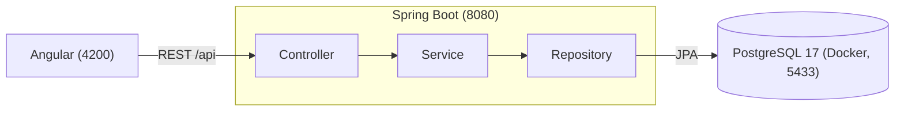

<div align="center">

#  StudyOS

**Meu sistema pessoal para planejar, registrar e entender como eu estudo.**

🇧🇷 Português · [🇺🇸 English](README.en.md)


</div>

---

##  Por que o StudyOS existe

Eu sou estudante de Ciência da Computação, trabalho com desenvolvimento de software e estudo o tempo todo: faculdade, Java, Angular, banco de dados, inglês, algoritmos. Durante muito tempo eu controlei tudo isso em uma **planilha**. Funcionava, mas dava trabalho para preencher e eu quase nunca olhava os dados depois.

Aí veio a pergunta: *e se eu transformasse esse problema no meu projeto de estudo?*

O **StudyOS** nasceu com dois objetivos ao mesmo tempo:

1. **Ser uma ferramenta real**, que eu use todo dia para organizar meus estudos e medir minha evolução.
2. **Ser meu laboratório Full Stack**: aprender Java, Spring Boot, Angular, PostgreSQL, Docker e nuvem construindo algo de verdade, do jeito que se faz profissionalmente (testes, migrations, Pull Requests).

Não é só uma lista de tarefas. A ideia é registrar o que eu **realmente** estudei e transformar isso em dados que ajudem a decidir o que fazer a seguir.

```
PLANEJAR  →  ESTUDAR  →  REGISTRAR  →  MEDIR  →  ANALISAR  →  AJUSTAR
```

##  O que ele vai fazer

- Organizar o estudo em **áreas → matérias → tópicos** (Faculdade, Full Stack, Inglês…)
- Montar uma **semana-modelo** e ajustá-la a cada semana
- **Registrar sessões** de estudo com duração, foco (1 a 5) e observações, em poucos segundos
- Mostrar um **dashboard** com horas por dia, por matéria e por área, e o cumprimento do planejado
- Comparar períodos (semana, mês, trimestre, ano) **sem julgar**: mais horas nem sempre é melhor
- Funcionar como **PWA**, instalável no celular

##  Em que pé estamos

O projeto é construído em **fatias verticais**: cada funcionalidade vai do banco até a tela antes de começar a próxima.

| Fatia | O que é | Situação |
|---|---|-|
| 0 | Fundação: repositório, banco no Docker, backend e frontend rodando, layout e tema claro/escuro | ✅ Pronta |
| 1 | **Áreas**: API REST (backend) |  Pronta |
| 1 | **Áreas**: telas em Angular |  Próxima |
| 2 | Matérias | |
| 3 | Tópicos e progresso | |
| 4 | Sessões de estudo | |
| 5 | Planejamento semanal | |
| 6 | Dashboard e métricas | |
| 7 | PWA e acabamento | |

## 🛠 Tecnologias

**Em uso hoje**

<p>
  
</p>

- **Backend:** Java 21 · Spring Boot 4 (Web, Data JPA, Validation, Actuator) · Hibernate · Flyway
- **Frontend:** Angular 22 (componentes standalone, Signals, rotas com lazy loading) · TypeScript · SCSS
- **Banco:** PostgreSQL 17, com migrations versionadas
- **Testes:** JUnit 5 · Mockito · MockMvc · Testcontainers (PostgreSQL real nos testes) · Vitest
- **Infra:** Docker e Docker Compose · Git e GitHub

**Nas próximas etapas**

<p>
  
</p>

RxJS e Reactive Forms · autenticação com JWT e Spring Security · PWA com service worker · deploy na **AWS** · CI/CD com **GitHub Actions** · observabilidade e backups

##  Arquitetura



- **Controller:** só traduz HTTP (rotas, validação, status). Nenhuma regra de negócio.
- **Service:** onde moram as regras (nome único, posição padrão, etc.) e as transações.
- **Repository:** acesso ao banco com Spring Data JPA.
- A **entidade nunca vira JSON**: a API fala por DTOs (`record`).
- O **schema do banco só muda por migration** (Flyway). O Hibernate apenas valida.
- Erros seguem o padrão `ProblemDetail` (RFC 9457): `400` com o erro de cada campo, `404` e `409`.

##  Como eu construo

Eu estou usando este projeto também para praticar a forma profissional de trabalhar:

- **Spec primeiro:** antes de codar, desenhei arquitetura, banco, regras e endpoints ([veja a spec](docs/specs/2026-09-28-studyos-fase1-mvp-design.md)).
- **TDD:** escrevo o teste, **vejo ele falhar**, implemento o mínimo para passar e refino.
- **Testes em três níveis:** service (rápido, com Mockito), controller (MockMvc) e ponta a ponta contra um PostgreSQL de verdade (Testcontainers).
- **Uma branch e um Pull Request por fatia**, com commits no padrão Conventional Commits (`feat:`, `fix:`, `docs:`…).

##  Como rodar

**Pré-requisitos:** Java 21 · Node.js 24+ · Angular CLI 22 (`npm install -g @angular/cli@22`) · Docker Desktop aberto.

**1. Banco de dados** (porta **5433**, para não colidir com um PostgreSQL local):

```bash
copy .env.example .env
docker compose up -d
```

**2. Backend** (porta 8080):

```bash
cd backend
.\mvnw.cmd spring-boot:run
```

**3. Frontend** (porta 4200), em outro terminal:

```bash
cd frontend
npm install
ng serve
```

Abra **http://localhost:4200**. Para conferir se o backend e o banco estão de pé: http://localhost:4200/actuator/health

> No macOS/Linux, use `cp .env.example .env` e `./mvnw spring-boot:run`.

**Testes**

```bash
cd backend
.\mvnw.cmd test        # requer o Docker aberto (Testcontainers)
```

```bash
cd frontend
ng test --watch=false
```

## 🔌 API de Áreas (já disponível)

| Método | Rota | O que faz |
|---|---|---|
| `GET` | `/api/areas?includeArchived=false` | Lista as áreas |
| `GET` | `/api/areas/{id}` | Busca uma área |
| `POST` | `/api/areas` | Cria (`201` com `Location`) |
| `PUT` | `/api/areas/{id}` | Atualiza |
| `PATCH` | `/api/areas/{id}/archive` · `/unarchive` | Arquiva / desarquiva |

As áreas **não são apagadas**: elas são arquivadas, para nunca perder o histórico de estudo.

## 🗂 Estrutura do repositório

```
studyos/
├── backend/             Spring Boot (Maven, Java 21)
├── frontend/            Angular
├── docs/
│   ├── specs/           Design do projeto
│   └── plans/           Plano de implementação de cada fatia
├── docker-compose.yml   PostgreSQL 17
└── .env.example         Variáveis do banco
```

> A documentação em `docs/` está em português.

## 🗺 Roadmap

- [x] **Fase 0** · Fundação (Git, Docker, Spring Boot, Angular, layout)
- [ ] **Fase 1 · MVP** · Áreas, matérias, tópicos, planejamento, sessões e dashboard básico
- [ ] **Fase 2** · Timer/Pomodoro, metas, streak, gráficos e relatórios
- [ ] **Fase 3** · Faculdade (provas e notas), projetos, livros, LeetCode e inglês
- [ ] **Fase 4** · Autenticação (JWT), sincronização e PWA completo
- [ ] **Fase 5** · AWS, CI/CD, observabilidade e backups

##  Autor

**João Mello** · [@Jmello01](https://github.com/Jmello01)

Estou construindo isso em público e aprendendo no caminho. Sugestões e dicas são muito bem-vindas.
